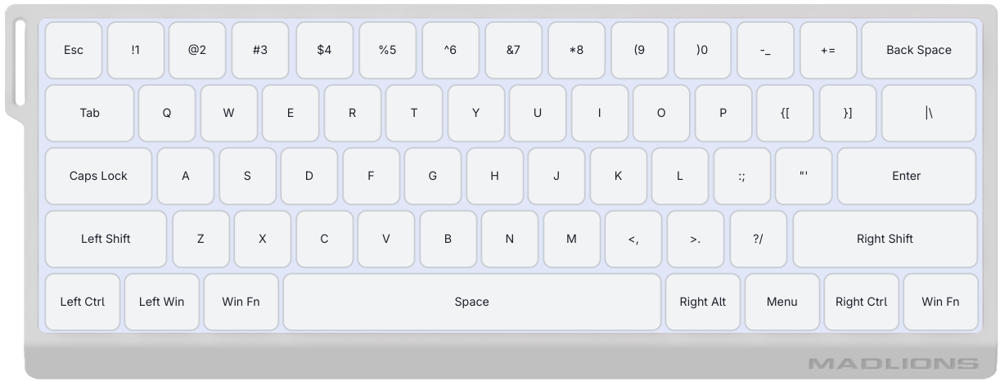
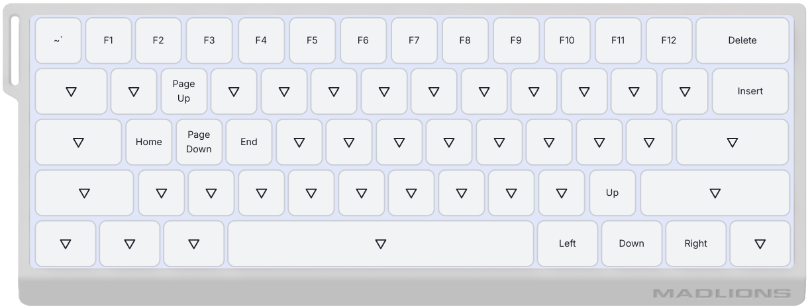

# kbconfig

My configuration for Madlions MAD 60HE keyboard for writing and coding.

Import `kbconfig.mad-keyboard-config` as a profile in Madlion's web driver.

# Cheatsheet

**Note**: Left Alt is replaced into Fn key, so only Right Alt is usable.

#### Navigation

| Key            | Bind        |
|----------------|-------------|
| Fn + w         | Page Up     |
| Fn + s         | Page Down   |
| Fn + a         | Home        |
| Fn + d         | End         |
| Fn + /         | Arrow Up    |
| Fn + Menu      | Arrow Down  |
| Fn + RightAlt  | Arrow Left  |
| Fn + RightCtrl | Arrow Right |

#### Editing

| Key            | Bind   |
|----------------|--------|
| Fn + Backspace | Delete |
| Fn + \         | Insert |

# Normal Layer

# FN Layer

